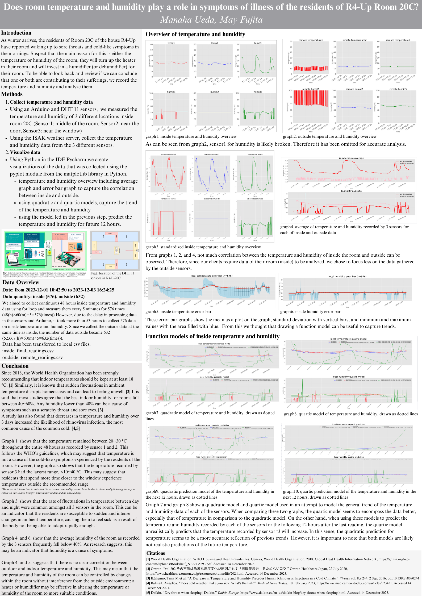

<sub>"Temperature Slider" by Chris Gannon, *https://dribbble.com/shots/4592784-Temperature-Slider*</sub>

# Unit 2: A Distributed Weather Station for ISAK

## Criteria A: Planning

## Problem definition
As winter arrives, the residents of Room 20C of the house R4-Up have reported waking up to sore throats and cold-like symptoms in the mornings. They suspect that the main reason for this is either the temperature or humidity of the room, but they still believe that there is a possibility for other factors to be at play as well. If they can be sure the reason for their suffering is the temperature, the residents can collectively decide to turn up the heater in their room. Similarly, if they can be sure that the humidity is to blame, together they will invest in a humidifier (or dehumidifier) for their room.

Room 20C is asking for a way to record the temperature and humidity of the room, to be able to look back and review if they can conclude that one or both factors are contributing to their sufferings in the morning.

## Proposed Solution
Considering the client requirements an adequate solution includes a low cost sensing device for humidity and temperature and a custom data script that process and analyzes the samples acquired. For a low cost sensing device an adequate alternative is the DHT11 sensor[^1] which is offered online for less than 5 USD and provides adequate precision and range for the client requirements (Temperature Range: 0°C to 50°C, Humidity Range: 20% to 90%). Similar devices such as the DHT22, AHT20 or the AM2301B [^2] have higher specifications, however the DHT11 uses a simple serial communication (SPI) rather than more elaborated protocols such as the I2C used by the alternatives. For the range, precision and accuracy required in this application the DHT11 provides the best compromise. Connecting the DHT11 sensor to a computer requires a device that provides a Serial Port communication. A cheap and often used alternative for prototyping is the Arduino UNO microcontroller [^3]. "Arduino is an open-source electronics platform based on easy-to-use hardware and software"[^4]. In addition to the low cost of the Arduino (< 6USD), this device is programmable and expandable[^1]. Other alternatives include different versions of the original Arduino but their size and price make them a less adequate solution.

Considering the budgetary constrains of the client and the hardware requirements, the software tool that I proposed for this solution is Python. Python's open-source nature and platform independence contribute to the long-term viability of the system. The use of Python simplifies potential future enhancements or modifications, allowing for seamless scalability without the need for extensive redevelopment [^5][^6]. In comparison to the alternative C or C++, which share similar features, Python is a High level programming language (HLL) with high abstraction [^7]. For example, memory management is automatic in Python whereas it is responsibility of the C/C++ developer to allocate and free up memory [^7], this could result in faster applications but also memory problems. In addition, a HLL language will allow me and future developers extend the solution or solve issues promptly.  

**Design statement**
Using an arduino and DHT 11 sensors, we will construct a system that can measure the temperature and humidity of 3 different locations inside room 20C, where our client wishes to check (as can be seen in fig.3). To do this, we will use Python in the IDE Pycharm, as well as a variation of C++ in the Arduino IDE [^8]. We will also create visualizations of the data that was collected using the pyplot module from the matplotlib library in Python, on Pycharm.

[^1]: Industries, Adafruit. “DHT11 Basic Temperature-Humidity Sensor + Extras.” Adafruit Industries Blog RSS, https://www.adafruit.com/product/386. 
[^2]: Nelson, Carter. “Modern Replacements for DHT11 and dht22 Sensors.” Adafruit Learning System, https://learn.adafruit.com/modern-replacements-for-dht11-dht22-sensors/what-are-better-alternatives.   
[^3]:“How to Connect dht11 Sensor with Arduino Uno.” Arduino Project Hub, https://create.arduino.cc/projecthub/pibots555/how-to-connect-dht11-sensor-with-arduino-uno-f4d239.  
[^4]:Team, The Arduino. “What Is Arduino?: Arduino Documentation.” Arduino Documentation | Arduino Documentation, https://docs.arduino.cc/learn/starting-guide/whats-arduino.  
[^5]:Tino. “Tino/PyFirmata: Python Interface for the Firmata (Http://Firmata.org/) Protocol. It Is Compliant with Firmata 2.1. Any Help with Updating to 2.2 Is Welcome. the Capability Query Is Implemented, but the Pin State Query Feature Not Yet.” GitHub, https://github.com/tino/pyFirmata. 
[^6]:Python Geeks. “Advantages of Python: Disadvantages of Python.” Python Geeks, 26 June 2021, https://pythongeeks.org/advantages-disadvantages-of-python/. 
[^7]: Real Python. “Python vs C++: Selecting the Right Tool for the Job.” Real Python, Real Python, 19 June 2021, https://realpython.com/python-vs-cpp/#memory-management. 
[^8]: Emeritus. "What are the Key Pros and Cons of the Arduino Programming Language?" Emeritus, Emeritus, 25 January 2023, https://emeritus.org/blog/coding-arduino-programming-language.

## Success Criteria
1. The solution provides a visual representation of the Humidity and Temperature values inside a dormitory (Local) and outside the house (Remote) for a period of minimum 48 hours. 
2. ```[HL]``` The local variables will be measure using a set of 3 sensors around the dormitory.
3. The solution provides a mathematical modelling for the Humidity and Temperature levels for each Local and Remote locations. ```(SL: linear model)```, ```(HL: non-lineal model)``` 
4. The solution provides a comparative analysis for the Humidity and Temperature levels for each Local and Remote locations including mean, standad deviation, minimum, maximum, and median.
5. ```(SL)```The Local samples are stored in a csv file and ```(HL)``` posted to the remote server as a backup.
6. The solution provides a prediction for the subsequent 12 hours for both temperature and humidity.
7. The solution includes a poster summarizing the visual representations, model and analysis created. The poster includes a recommendation about healthy levels for Temperature and Humidity.

## TOK Connection
**To what extent does ```the use of data science``` in climate research influence our understanding of environmental issues, and what knowledge questions arise regarding the ```reliability, interpretation, and ethical implications``` of data-driven approaches in addressing climate change**

1. How does our use of technology shape our understanding of the environment?

_Being able to use technology to gain quantitative and qualitative data helps us develop a more accurate understanding of the environment we live in. Where on our own, we may not be able to accurately measure the temperature and humidity of our room, using technology, we can gain precise measurements that can then help us understand trends, potential outcomes, identify issues, etc. Compared to human judgement alone, technology can sometimes be more reliable: tools can measure more significant figures, less bias in the process of obtaining these measurements, etc. Using technology, our understanding of the environment extends from just being what we can observe with our own five senses, into something that can be developed into helping us make accurate predictions or better choices._

2. What responsibilities do we have as technologists when it comes to handling personal data related to our living spaces?

_Technologists have the responsibility to collect and gather personal data only when there is the consent of the one living in the space being investigated. Technologists have the responsibility to be clear what the collected data will be used for, the duration in which the personal data will be used/kept for, and who the data will be available to. This investigation reveals the information about one of the project members' living quarters to the people that read this documentation. Consent to use of the room and data collected from the room was given by all the students from the room, as they trust that the data will not be used for malicious purposes. Technologists therefore have the obligation to uphold that trust that was generously given to them, protect the data so that it is only used for the purpose that it was granted for, and be clear with all parties about where this data is being used._

3. What cultural and contextual factors might impact our interpretation of the results, especially when comparing our local readings with those from the campus? 

_Cultural factors that impact our interpretation can be what temperatures and humidities we view as acceptable or unacceptable. Many people from this school especially come from places where Japan's climate is hugely different to what they are used to. Therefore, even the same temperature or humidity recorded could be described in a different qualitative way between two people analyzing the results. (e.g. 20C may be hot for a winter for some, while others who may come from places without winters may consider it cold) On the other hand, contextual factors that may impact our interpretation is bias according to the knowledge we have about the environment we are recording. For example, especially when investigating your own room that you live in, if you wake up every day thinking that it is cold (like many of us do), even when the collected data tells you otherwise, you might refuse to believe it as in your mind, it is knowledge that your room is cold. These factors that make up biases when analyzing data can be considered valid, if you consider your observations from a daily basis to be in a way, an experiment itself too. However, it is also important to acknowledge that bias may exist when trying to analyze data, and evaluating the reliability of your results as well as your day to day observations._

# Criteria B: Design

## System Diagram **HL**


**Fig.1** shows the system diagram for the proposed solution (**HL**). The indoor variables will be measured using an Arduino and three DHT11 sensors located inside a room. Three sensors are used to determine more precisely the physical values and include measurement uncertainty. The outdoor variables will be requested to the remote server using a GET request to the API of the server at ```192.168.6.153/readings```. The local values are stored in a CSV database locally and a backup copy will be store in the remote server using the **Weather API**. 


**Fig.2** shows the hardware architecture of the Arduino. The Arduino is connected to the computer using a USB cable. The DHT11 sensors are connected to the Arduino's pins as shown. The Arduino is powered by the computer using the USB cable.


**Fig.3** shows the location of the DHT 11 sensors in the room. One is placed in the middle of the room, another on a shelf in front of the door, and another in front of the window of the room. The sensors measure the temperature and humidity of the room at these locations.

## Flow Diagrams


**Fig.4** shows the flow diagram for the function `read` to retrieve data gathered in the arduino on PyCharm.


**Fig.5** shows the flow diagram for how the program collects humidity and temperature data on Pycharm, and then how this data is stored in a csv file and remote server.


                                                                                                  
**Fig.6** shows the flow diagram for the function `get_sensor_w_date` and how it obtains temperature and humidity data from the remote servers.


                                                                                                  
**Fig.7** shows the flow diagram for the function `get_sensor_w_date` and how it obtains temperature and humidity data from the remote servers.

## Test Plan
| Test Type        | Test Content                                                                                                         | Input                                                                                                                                                                                                                                                                                                                                                                 | Expected Output                                                                                                                                                                                                                                                                                                                                                                                                                                                                                                               |
|------------------|----------------------------------------------------------------------------------------------------------------------|-----------------------------------------------------------------------------------------------------------------------------------------------------------------------------------------------------------------------------------------------------------------------------------------------------------------------------------------------------------------------|-------------------------------------------------------------------------------------------------------------------------------------------------------------------------------------------------------------------------------------------------------------------------------------------------------------------------------------------------------------------------------------------------------------------------------------------------------------------------------------------------------------------------------|
| Unit/Performance | Check Arduino Connects to Computer, and that the connection is fast as an indicator that it is functioning correctly | After identifying connected Arduino's id, use the serial.serial() function on PyCharm to establish a serial connection. Set the parameter timeout to 0.1                                                                                                                                                                                                              | Program does not timeout. A message confirming that a connection has been established printed onto PyCharm console.                                                                                                                                                                                                                                                                                                                                                                                                           |
| Unit             | Check that Sensor Retrieves Data and Sends to Computer                                                               | Upload program from Arduino IDE that identifies a sensor connected to the correct pins, and reads from so.                                                                                                                                                                                                                                                            | A serial connection should be established between the arduino and the computer. The recorded temperature and humidity should appear in the console as follows: "Temperature: t1, Humidity: h1"                                                                                                                                                                                                                                                                                                                                |
| Integration      | Check All 3 Sensors Can Retrieve Data and Send Data in the same Circuit                                              | 1. Connect 3 DHT sensors to Arduino at once 2. Upload program from Arduino IDE that a) correctly identifies the 3 sensors in the correct pins and b) returns readings from all 3 sensors 3. Run program in PyCharm which reads and prints lines stored in Arduino                                                                                                     | A serial connection should be established between the arduino and the computer. When running program, a total of 6 different values (a temperature value and humidity value from each of the 3 sensors) should be printed onto the console.                                                                                                                                                                                                                                                                                   |
| Integration      | Check that readings can be saved into a csv file per certain amount of time                                          | Run program in PyCharm which reads the data from the Arduino each second for 30 seconds, and then saves the data into a csv file once per 10 seconds.                                                                                                                                                                                                                 | A new csv file called "test_readings.csv" should be created. Within it, there should be 3 lines: 10,(datetime of recording),t1,t2,t3,h1,h2,h3 20,(datetime of recording),t1,t2,t3,h1,h2,h3 30,(datetime of recording),t1,t2,t3,h1,h2,h3                                                                                                                                                                                                                                                                                       |
| Unit             | Create Test Sensor and Recording on Server                                                                           | 1. Using requests, register user on server, under username MMproject 2. Similarly, get access token through requests 3. Using access token, create a new sensor called "testing" 4. Confirm "testing" exists under user using requests 5. Send a test recording {'sensor_id:{id},'value':6} to "testing" using requests 6. Get recordings on "testing" using requests | 1. answer should be printed, informing the successful creation of a new user 2. answer should be printed, an access token 3. answer should be printed, informing the successful creation of a new sensor "testing", and its id 4. answer should be printed, showing all of the sensors on the server. The most recent sensor added should be "testing" under user MMproject 5. answer should be printed, showing the datetime, value, and sensor id recorded 6. answer should be printed, containing recording of {'value':6} |
| Integration      | Check that readings can be sent to the server per certain amount of time                                             | Run program in PyCharm which reads the data from the Arduino each second for 30 seconds, and then sends the data {'sensor_id:{id}, 'value':{t1}} to the sensor "testing" previously created on the server using a POST request each 10 seconds. Then, using a GET request, retrieve recordings on "testing" to confirm there are 3 recordings.                        | The last 3 recordings in the sensor should contain key and value pairs of {'value':{t1}}. The t1 value should correspond to the t1 value printed on the console at t=10, 20, and 30.                                                                                                                                                                                                                                                                                                                                          |
| Usability        | Check that the graphs are easy to comprehend and meaningful.                                                         | Show the clients (20C) the graphs, and ask them to describe the graph and the data it is representing                                                                                                                                                                                                                                                                 | Ideally, they would be able to answer what kind of data each graph is expressing (e.g. when looking at the average of temperature, they should be able to say that they see the average of the 3 temperature values being plotted). If this test fails for any of the graphs, there is a need to make adjustments, such as adding labels, using different colors, etc.                                                                                                                                                        |

## Record of Tasks
|    | Planned Action                                                      | Planned Outcome                                                                                        | Time estimate | Target completion date | Criterion |
|----|---------------------------------------------------------------------|--------------------------------------------------------------------------------------------------------|---------------|------------------------|-----------|
| 1  | Write the Problem Context and Design Statement                      | Have finalized the problem context and design statement                                                | 10min         | Nov 22                 | A         |
| 2  | Code and Upload Program for Arduino on Arduino IDE                  | Create and upload program for data collection onto the arduino                                         | 30min         | Nov 29                 | C         |
| 3  | Construct Arduino Circuit for Data Collection                       | Have sensors connected to the Arduino, ready to connect to the computer and start collecting data      | 1hr           | Nov 29                 | C         |
| 4  | Form Test Plan                                                      | Outline test plans to check functionality of our solution as we develop our proposed solution          | 1hr           | Nov 29                 | B         |
| 5  | Test serial connection between arduino and computer                 | Have confirmed that the arduino and computer can form a serial connection                              | 15min         | Nov 29                 | C         |
| 6  | Test Each DHT11 Sensor and their connection to Arduino              | Confirm that all sensors can return a valid temperature and humidity reading                           | 15min         | Nov 29                 | C         |
| 7  | Code Data Collection Method on PyCharm                              | Create a program that retrieves data from the Arduino every 5 minutes                                  | 30min         | Nov 29                 | C         |
| 8  | Test if readings can be saved to a new csv file                     | Have confirmed that we can directly take readings and save it in a new csv file                        | 20min         | Nov 30                 | C         |
| 9  | Test if readings can be sent to remote server                       | Have confirmed that we can create new sensors on the server, and save data within this sensor          | 30min         | Nov 30                 | C         |
| 10 | Code Data Storage Method on PyCharm                                 | Create a program that stores retrieved data locally on a csv file, and remotely on sensors in a server | 1hr           | Nov 30                 | C         |
| 11 | Test and Finalize Hardware and Software                             | Fix any bugs or add additional functions as necessary before starting final data collection            | 2hr           | Nov 30                 | C         |
| 12 | Collect Temperature and Humidity Data for 48 Hours                  | Collect data per 5 minutes over the course of 48 hours from 3 different sensors                        | 48hr          | Nov 30 ~ Dec 3         | C         |
| 13 | Create Flow Diagrams and Reference Figures                          | Create 3 flow diagrams and supplementary diagrams that help explain our method                         | 1hr           | Nov 31 ~ Dec 12        | B         |
| 14 | Construct Graphs Using Pyplot                                       | Have graphs for raw data and average using pyplot                                                      | 3hr           | Dec 4 ~ Dec 12         | C/D       |
| 15 | Conduct usability testing to check if graphs represent data clearly | Have finalized graphs that are easy to understand and comprehensible by anyone                         | 30min         | Dec 13                 | D         |
| 15 | Design Scientific Poster                                            | Finish a poster containing created graphs and an adequate conclusion summarizing the investigation     | 2hr           | Dec 14                 | D         |
| 16 | Film Video Introducing Product                                      | Finish a video that demonstrates proposed solution to clients                                          | 1hr           | Dec 14                 | D         |

# Criteria C: Development
## List of techniques used
- For Loop
- While Loop
- If/Else Statements
- Functions
- Lists and Dictionaries
- Libraries
  - Comma Separated Values (CSV) Files
  - Serial Communication 
  - Application Programming Interface (API)
  - Data Visualization

## List of libraries used ```Graphing section left (crit. 1, 3, 4, 6)```
PyCharm: CSV, Time, Datetime, Requests, Matplotlib (pyplot module), Numpy

Arduino IDE: Adafruit DHT Sensor Library

## Development
### Code from Arduino IDE
In order to be able to read data from the sensors, there is a need to compile and upload a program to the arduino. This is done using the Arduino IDE. The code we wrote as follows.

From file ```arduino.ino```:
```.C++
#include "DHT.h"
#define DHTTYPE DHT11   // DHT 11 Sensor

#define DHTPIN1 13     // what pin of the arduino each sensor's data pin is connected to
DHT dht1(DHTPIN1, DHTTYPE);
```
**(Success Criteria 2)** In the first line, we include the `DHT.h` class from the Adafruit Unified Sensor Library. This library is necessary in our program as it allows the arduino to identify and communicate with the DHT sensors connected to it. In the second line, we define the type of sensor we are using. For our solution, we are using the DHT11 sensor.

The third and fourth line defines the pin of the arduino that the sensor is connected to, and creates the sensor's identity so that it can be used in later programs. This is done for all 3 sensors, changing the number of the pin in the arduino (defining `DHTPIN2`, `DHTPIN3`), and then the corresponding id of the sensor (`dht2`, `dht3`). The pins that the sensors are connected to can be seen in fig. 2.

```.C++
void setup() {
 pinMode(12, OUTPUT);//PIN 12 used as a 5V port
 digitalWrite(12,HIGH);
 pinMode(3, OUTPUT);//PIN 3 used as a 5V port
 digitalWrite(3,HIGH);
 Serial.begin(9600);
 Serial.println(F("Hello! Arduino has started"));
 dht1.begin();
 dht2.begin();
 dht3.begin();
}
```
Next, in this section we define the setup of the arduino. For digital pins of the Arduino, there is a need to configure them if they are used [9]. To do this, we use `pinMode()` which takes two parameters, the pin number, and the mode in which it should behave. First, we specify that we wish to set up pin 12 as an output port. In the second line, we use digitalWrite, which takes the pin number and either `LOW` or `HIGH` as parameters to set the pin's output voltage. As DHT sensors require a 5V voltage to function, we set pin 12 to `HIGH`. The same is done for pin 3. Next, we start the serial communication between the arduino and the computer, and print a message to check if the arduino is working. In the last three lines, we start each of the sensors.

```.C++
void loop() {
  delay(1000);
  // Readings for DHT1
  float h1 = dht1.readHumidity();
  float t1 = dht1.readTemperature();
```
A loop is started to read data from the sensors every second. As shown above, first, the program tells the arduino to wait 1000 ms (1 second) at the start of each iteration. The program tells the arduino to read the humidity from the sensor `dht1` as defined previously, and stores the value in the variable `h1`. The same is done for the temperature. This code is repeated for all the sensors, changing the number of the sensor (`dht1`, `dht2`, `dht3`) and the variable names (`h1`, `t1`, `h2`, `t2`, `h3`, `t3`) for each sensor. This results in 6 variables created by the arduino in total, a temperature and humidity variable per sensor.

```.C++
  //Check for errors
  if (isnan(h1) || isnan(t1) || isnan(h2) || isnan(t2) || isnan(h3) || isnan(t3)) {
   Serial.println(F("Failed to read from DHT sensor!"));
  return;
  }
```
Within the loop, next, the program checks to make sure that all the sensors read a value. In this if statement, if any of the variables is not a number `isnan()`, the program prints a message on the serial device and returns to the start of the loop.

```.C++
  // Print and check the readings for DHT1
  Serial.print(t1);
  Serial.print(",");
}
```
After checking for potential errors, the program can then proceed to printing the values of the collected temperatures and humidities on the serial device. This is the data that we can use on Pycharm after it gets transferred to the serial device, therefore we decided to send the collected data in the form of `t1,t2,t3,h1,h2,h3` as using Python, we can split this string by comma and reach each variable using the respective index of the list. According to the Arduino Forum, the best practice for printing multiple variables in one line for C++ is to repeat the `serial.print()` function [10]. The above code shows how we use two lines of code to print one variable, and a comma. These two lines are repeated for every other variable (`t2`, `t3`, `h1`, `h2`, `h3`).

### Code from PyCharm
**(Success Criteria 5)** First, we identified the need to be able to communicate with our remote server to back up our data. We decided to have a remote storage of the data we collected so that should the local backup malfunction or become inaccessible, the same data can be retrieved again my obtaining backup data on the server. 

From file ```API.py```:
```.py
import requests

user = {"username": "MMproject", "password": "MMproject2"}  # User on server
ip = "192.168.6.153"  # IP address of server
```
To be able to retrieve and send data to a server, there is first a need to import the `requests library`. This is done in the first line. The API of the server we will be using to store our data requires users to register first before being able to do certain functions. Hence, we then define the user data that will be used to register an user to upload the gathered data to the server. The details should be in the form of a json dictionary, which is the format used to store and transmit data between a user and server. We also store the ip address of the server as a string in the variable ip. This makes it easier to call the ip address in future requests.

```.py
# Register User [ONLY RUN ONCE]
answer = requests.post(f'http://{ip}/register', json=user)  # Register user, save result in answer
print(answer.json())  # Print answer to check if it worked
```
Next, there is a need to register the user on the server. This is done in the first line, by sending a POST request to the server with the user data that we stored in the dictionary user previously. This is done only once, as the user will be registered on the server after the first run of the program. In the next line, the result of the request is then printed to check if it worked.

```.py
# Log-in to get Cookie
answer = requests.post(f'http://{ip}/login', json=user)  #Login to server, save result in answer
print(answer.json())  # Print answer to check if it worked
cookie = answer.json()["access_token"]  # Get access token from server, save in cookie
print(cookie)  # Print cookie to check if it worked


# Put the cookie in the header of the request
header = {'Authorization':f'Bearer {cookie}'}  # Create header for authorization for future requests
```
After a user is registered, there is a need to login in order to gain access to more functions using the server. This is done in the first line by sending a `POST` request to access the login endpoint of the server. In the second line, the result of the request is then printed to check if it worked. Within this answer, there is an access token that is sent from the server to the user. An access token allows the user to access further functions on the server that is limited to only users that are logged in. In the third line, this access token is stored in the variable `cookie`. In the fourth line, `cookie` is printed to check if the access token was saved correctly.

We also save `cookie` in the dictionary `header`, as the value of the key `Authorization`. This is done as for functions that require a logged-in user, a header is required to be sent with the request. If there is a valid access token within the header, the request can be done. Like the ip address, saving the header in a dictionary makes it easier to call the header in future requests.

```.py 
# Create Sensors [ONLY RUN ONCE]
s1_t = {
    'type': 'temperature',
    'location': 'table',
    'name': 'dht1_temp',
    'unit': 'C'
} #id=29 (id of the sensor created at the first run of this program)

answer = requests.post(f'http://{ip}/sensor/new', json=s1_t, headers=header)  # Create new sensor on server, changing the json parameter for each sensor
```
Next, there is a need to create new sensors on the server, which is the remote storage of our collected temperature and humidity data. This can be done by sending a `POST` request. In the first line, we create a dictionary for the data required in the sensor. In our server, this includes the type of sensor, the location of the sensor, the name of the sensor, and the unit of the measurements used. Each of these are keys in the dictionary, and the values are changed as we create new sensors. In the second line, we send the `POST` request to the server to create a new sensor. The JSON parameter is the dictionary we created previously, and the header parameter is `header` we created previously. This is repeated for all the sensors, changing the values of the keys in the dictionary sent. This resulted in 6 sensors on the server, each with a unique id from 29~34.

Next, there is a need to collect data from the arduino in a form that can be manipulated in the serial device (computer connected to the arduino) for storage. First, we identified the need to create a function on PyCharm that reads the data sent by the arduino.

From file ```solution.py```
```.py
import serial
id = "cu.usbserial-110"  #id of Arduino on computer
arduino = serial.Serial(port=f'/dev/{id}', baudrate=9600, timeout=0.1)  #id of Arduino on computer
print("Connection Successful")  #Let user know Arduino is connected
```
In order to be able to take the data collected on the arduino, there is a need to create a serial connection between the arduino and the computer. This can be done by importing the `serial` library. In the first line, we store the id of the arduino as identified by the computer in the variable `id`. In the second line, we use the `serial.Serial()` function. The port parameter is the id of the arduino. This connection is stored as the variable arduino, which can be used again later. In the last line, we print a message to the user to check that the connection has been established.

Next, we created a function that reads the data collected on the arduino. This is shown in fig. 4,  as well as in the program that follows:
```.py
def read() -> str:
    """Read data from Arduino. Return data as a string."""
    data = ""  # Create empty string
    while len(data) < 1:  # When data is empty
        data = arduino.readline()  # Read data collected on Arduino (sensors)
    return data.decode('utf-8')  # utf-8 is the same as ascii
```
In the first line we create an empty string and store it as the variable data. In the next line, using a while loop, we check if the length of the string is less than 1 (if the string is empty.) This is to ensure that the program does not store empty data or read the next collected data before it stores the previous one. If the string is empty, the program proceeds to read the data collected on the arduino using the `readline()` function. The line read refers to the string containing the 6 measurements that was created in the Arduino IDE. In the last line, the data is returned from the function as a string, and decoded into ascii.

As per the success criteria, there is a need to collect data from the arduino for 48 hours. The flow diagram for how this is done can be found as fig. 5.
```.py
humidity = []  # List to store humidity data
temperature = []  # List to store temperature data
t = 0  # Variable to store time elapsed in seconds
for i in range(172801):  # Loop for 17800 seconds (=48 hours)
    msg = read()  # Read data from Arduino
    print(t, msg)  # To check what data the program reads
    time.sleep(1)  # Wait 1 second
    t += 1  # Add 1 to the variable t corresponding to the seconds passed
```
In order to be able to see the data that the arduino transfers to there is a need for the program to read the data from the arduino. This can be done by using the read function defined previously. In the first line, we create two empty lists to store the humidity and temperature data. In the second line, we create a variable `t` to store the time elapsed in seconds.
**(Success Criteria 1)** Next, we start a for loop that loops 172801 times (number of seconds in 48 hours). Within the loop, the `read()` function is called to obtain the temperature and humidity data from the arduino. The returned string is saved as the variable `msg`. Next, the time elapsed in seconds and the data read from the arduino is printed onto the console so that the user can check the progress of the loop. In the next line, the program waits 1 second using the `sleep()` function from the `time` library, and 1 is added to the variable `t`, before looping back to the start of the for loop.

```.py
import csv
import datetime
```
**(Success Criteria 5)** A requirement is that there is a local copy of the data collected. Therefore, we chose to store our data in a csv file. To do this, we import the `csv` library, and also the `datetime` library to be able to record the time the data was collected. The import statements are done at the beginning of the file.

```.py
    # Record the data once in 5 minutes
    if t%300 == 0:  # Per 5 minute interval (=300 seconds)
        # Storing Data in CSV File
        date = datetime.datetime.now()  # Find time data of the moment
        line = f'{t},{date},{msg}\n'  # Time in seconds, datetime, msg containing sensor readings
        with open('final_readings.csv', mode='a') as f:  # Open file in mode append
            data = f.writelines(line)  # Add line to CSV file
```
In the above program, an if statement checks if `t` is a multiple of 300, representing that 5 minutes have elapsed. Within the if statement, the program first saves the date and time at the moment in the variable `date` using the `datetime.now()` function. In the next line, we create a string in the variable `line`, which formats `t`, `date` and `msg`, each separated by a comma. This is the string that will be stored in the csv file. In the next line, the csv file `final_readings.csv` is opened using the with the `open()` function from the `csv` library. The mode is set to append, so that the program does not overwrite the previous data collected. In the next line, `line` is added to the csv file using the `writelines()` function. Fig. 7 below shows a screenshot of the first 15 lines of the csv file.


**Fig. 7** Screenshot of the first 15 lines of the csv file. The first value is the time in seconds elapsed. The second value is the date and time of the recording. The third value onwards represents the readings in the order of `t1`, `t2`, `t3`, `h1`, `h2`, `h3`. **(Success Criteria 5)**


```
import requests
from API import ip, header
```
**(Success Criteria 5)** As per requirements of the proposed solution, there is also a need to store the data collected on the server. This can be done by sending a `POST` request to the server. To do this, there is a need to import the `requests` library, as well as the `ip` and `header` variables to be reused from the file `API.py`. The import statements are done at the beginning of the file.

```.py
        # Storing Data in Sensors on Server
        a = list(msg.split(',')) # Split the msg (data from Arduino) into a list
        sensor_id = 29  # First of our sensors on the server
        r = 0  # Index of the list of readings

        # Create new posts for each sensor on the server
        while sensor_id <= 34:  # Loop through all of our sensors
            record = {f'sensor_id':sensor_id, 'value':a[r]}  # Create a record for each sensor
            print(record)  # To check what data the program sends to the server
            answer = requests.post(f'http://{ip}/reading/new', json=record, headers=header)  # Send data to server
            sensor_id += 1  # Next sensor
            r += 1  # Next reading
```
The above code is nested within the same if statement that runs when `t` is a multiple of 300 (5 minute intervals). first, the program splits the string `msg` into a list using the `split()` function. The list is saved as `a`. As we will be using a for loop to send each of the data to each of the sensors in the server, in the next line, we create a variable `sensor_id` to store the id of the first sensor on the server. We also create a variable `r` to store the index of the list of readings. In the next line, we start a while loop that loops until `sensor_id` is greater than 34, which is the id of the last sensor on the server. Within the loop, a temporary dictionary `record` stores the id of the sensor the data is to be sent to, and the value of the reading by taking it from the list `a` using the index `r`. In the next line, the dictionary is printed to check that the data is in the correct format. Next, we send a `POST` request to the server to create a new reading. The JSON parameter is the dictionary `record` we created previously, and the header parameter is `header` imported from `API.py`. In the final line we add 1 to `sensor_id` and `r` to loop through the next sensor and reading. When this is done, the program loops back to the start of the while loop, and when the while loop finishes, it returns back to the start of the for loop. Fig. 8 below shows a screenshot of the readings on the server, obtained through a `GET` request to the server.


**Fig. 8** Screenshot of the readings on the server for server_id 31: our t3 sensor. The value for the key 'value' in each of the individual dictionaries represent the readings sent to the server. **(Success Criteria 5)**
## GRAPH NO DOCUMENTATION KOKO ONEGAISHIMASU **(Success Criteria 1, 3, 4, 6)**


**(Success Criteria 1,3,4,6)** First, to create graphs, we read the local temperature and humidity values from the csv file (final_readings.csv).

From file ```.graph py```:
```.py
with open('final_readings.csv', mode='r') as f:
    data = f.readlines()
    date_list=[]
    temp1 = []
    humid1 = []
    temp2 = []
    humid2 = []
    temp3 = []
    humid3 = []
    t=0
    time=[]
    for line in data:
        rec = line.split(',')
        tdatetime = dt.strptime(rec[1][:16], '%Y-%m-%d %H:%M')
        date_list.append(tdatetime)
        temp1.append(float(rec[2]))
        temp2.append(float(rec[3]))
        temp3.append(float(rec[4]))
        humid1.append(float(rec[5]))
        humid2.append(float(rec[6]))
        humid3.append(float(rec[7]))
        time.append(t)
        t+=5
```

Also, to get temperature and humidity values from the server at the same time with the local measurement. However, the server didn't working when we were collecting the local data. Refering the weather of Karuizawa at the time when we were collecting the local data, we used the other date's server data which has similar weather.

**Fig. 9** Screenshot of Karuizawa weather on December 1st (local data was running).

**Fig. 10** Screenshot of Karuizawa weather on December 2nd (local data was running).

**Fig. 11** Screenshot of Karuizawa weather on December 3rd (local data was running).

**Fig. 12** Screenshot of Karuizawa weather on December 6th (use as December 1st weather).

**Fig. 13** Screenshot of Karuizawa weather on December 7th (use as December 2nd weather).

**Fig. 14** Screenshot of Karuizawa weather on December 8th (use as December 3rd weather).

In order to get the temperature and humidity from the sever, we defined the strat date and end date and get the specific day's temperature and humidity data by using for loop. To merge with the local data in terms of date, made 6 days delay on the datetime value we took from the server.

from file ```remote.py```
```.py
def get_sensor_w_date(id:int=1, ip:str="192.168.6.153"):
    from_dt = datetime(2023, 12, 7, 10, 45)
    to_dt = datetime(2023, 12, 9, 16, 25)
    request = requests.get(f"http://{ip}/readings")
    data = request.json()
    sensors = data['readings'][0]
    sensor = []
    time=[]
    for s in sensors:
        if s['sensor_id'] == id:
            sensor_datetime = datetime.strptime(s['datetime'][:16], "%Y-%m-%dT%H:%M")
            adjusted_sensor_datetime = sensor_datetime - timedelta(days=6)
            if from_dt <= sensor_datetime<= to_dt:
                sensor.append(s['value'])
                time.append(adjusted_sensor_datetime)
    return time,sensor
```

To save the data we collected from the server, created the csv file `remote_readins.csv` and saved the data in that csv file.
from file ```remote.py```
```.py
for t in range(len(r_temp1[0])):
    line = f'{r_time[t]},{r_temp1[1][t]},{r_temp2[1][t]},{r_temp3[1][t]},{r_humid1[1][t]},{r_humid2[1][t]},{r_humid3[1][t]},{r_humid1_fake[t]}\n'
    with open('remote_readings.csv', mode='a') as f:
        f.writelines(line)
```

In order to use the data collected by the server which is stored in the `remote_readings.csv` file to create graphs, we obtained the data on that data on `graph.py`.
from file ```graph.py```
```.py

with open('remote_readings.csv', mode='r') as f:
    data = f.readlines()
    r_temp1 = []
    r_temp2 = []
    r_temp3 = []
    r_humid1 = []
    r_humid2 = []
    r_humid3 = []
    r_humid1_fake = []
    r_time =[]

    for line in data:
        rec = line.split(',')
        tdatetime = dt.strptime(rec[0][:16], '%Y-%m-%d %H:%M')
        r_temp1.append(float(rec[1]))
        r_temp2.append(float(rec[2]))
        r_temp3.append(float(rec[3]))
        r_humid1.append(float(rec[4]))
        r_humid2.append(float(rec[5]))
        r_humid3.append(float(rec[6]))
        r_humid1_fake.append(float(rec[7]))
        r_time.append(tdatetime)
```


**(Success Criteria 1)** To visualize the overview of temperature and humidity data from both local and server, we created the graph representing those data individually.
The code below shows the drawing local temperature data from sensor 1. We did the same process in other two temperatre data and also three humidity data.

from file ```graph.py```
```.py
fig = plt.figure(figsize=(30,20))
plt.subplots_adjust(hspace=0.5)

plt.subplot(2,3,1) # temp1
plt.ylim(0,60)
temp1_graph=draw_graph(t=date_list, v=temp1, color='red', title="temp1")
plt.xlabel("time", fontsize=20)
plt.ylabel("temperature (C)", fontsize=20)
plt.gca().xaxis.set_major_locator(mdates.HourLocator(interval=10))
```

**Fig.15** Local Temperature and Humidity overview graph


We did the same thing on the remote data and plot the graph.
from file ```graph.py```
```.py
locator = MaxNLocator(nbins=7)

fig = plt.figure(figsize=(30,20))
plt.subplots_adjust(hspace=0.5)

plt.subplot(2,3,1) # temp1
plt.ylim(0,60)
temp1_graph=draw_graph(t=r_time, v=r_temp1, color='red', title="remote temperature1")
plt.xlabel("time", fontsize=20)
plt.ylabel("temperature (C)", fontsize=20)
plt.gca().xaxis.set_major_locator(locator)
plt.gca().xaxis.set_major_formatter(mdates.DateFormatter('%m-%d %H:%M'))
```
**Fig.16** Remote Temperature and Humidity overview graph

In addition, to make it easier to compare the local and remote graph, we took both average and plot the graph representing local and remote avrage of temperature and humidity.
The code below shows the temperature average graph plotting, and we did the same thing for the humidity, too.
from file ```graph.py```
```.py
fig = plt.figure(figsize=(40,20))
plt.subplots_adjust(hspace=1, bottom=0.5)
plt.subplot(2,1,1)

l_temp_avg=basic_info(temp1,temp2,temp3)[0]
r_temp_avg=basic_info(r_temp1,r_temp2,r_temp3)[0]

plt.plot(date_list,l_temp_avg, label="local temperature", c='red', lw=5)
plt.plot(r_time,r_temp_avg, label="remote temperature", c='pink', lw=5)

plt.gca().xaxis.set_major_locator(mdates.HourLocator(interval=5))
plt.gca().xaxis.set_major_formatter(mdates.DateFormatter('%m-%d %H:%M'))
plt.xticks(fontsize=30, rotation=30, ha='right')
plt.yticks(fontsize=30)
plt.title("temperature average",fontsize=50)
plt.xlabel("time", fontsize=30)
plt.ylabel("temperature (C)", fontsize=30)
plt.tight_layout()
plt.legend(fontsize=30, loc="upper right")
```

**Fig.17** Local and Remote Temperature and Humidity average graph

Since the local temperature graph of measured by the sensor3 was significantly different from the other two sensors. Therefore, we standardized that local data to compare the rate of change in temperature. To standarized the data by using `StandardScaler` module from `sklearn.preprocessing` library. To make it easier to standarlize, we created a function called `standardalization` on the `graph_lib.py` which returns the standarlized values.

from file ```graph_lib.py```
```.py
def standardalization (data:list):
    data_array = np.array(data)
    data_reshaped = data_array.reshape(-1, 1)
    scaler = StandardScaler()
    sc_data = scaler.fit_transform(data_reshaped)
    time = np.arange(sc_data.shape[0])
    return time, sc_data
```

By using that standardalization function, we plot the standarlized graph.
from file ```graph.py```
```.py
fig = plt.figure(figsize=(30,20))
plt.subplot(2,3,1)
time, sc_temp1 = standardalization(take_data()[0])
plt.plot(date_list, sc_temp1, color=c[0])
plt.title("standardized temp1", fontsize=20)
plt.xlabel("time", fontsize=20)
plt.ylabel("temperature (C)", fontsize=20)
plt.xticks(rotation=30)
plt.gca().xaxis.set_major_locator(mdates.HourLocator(interval=10))
```

**Fig.18** Local standarlized Temperature and Humidity graph


**(Success Criteria 3)** To capture the trend of the temperature and humidity for the prediction, we led the mathematical modelling


from file ```graph.py```
```.py
import 
```
from file ```graph.py```
```.py
import 
```
from file ```graph.py```
```.py
import 
```
from file ```graph.py```
```.py
import 
```


from file ```graph.py```
```.py
import 
```


from file ```graph.py```
```.py
import 
```


[^9]: Arduino. "Digital Pins." Arduino, Arduino, 5 December 2023, https://www.arduino.cc/reference/en/language/functions/digital-io/digitalwrite/.
[^11]: Koronus. "print multiple variables amount in one line." Arduino Forum, Arduino, 6 May 2021, https://forum.arduino.cc/t/print-multiple-variables-amount-in-one-line/604071/9
# Criteria D: Functionality

## Video of proposed solution
The video can be found under the name "Project 2- Weather Station.mov" in this Google Drive Folder: 
https://drive.google.com/drive/folders/1tMNTtgjcs2QFEaba9YF4Wc9Ikm9p6jiU?usp=drive_link
## Scientific Poster of Investigation:

**Fig. 9** a scientific poster of investigation, created using Canva. Created by Manaha Ueda and May Fujita. **(Success Criteria 7)**
