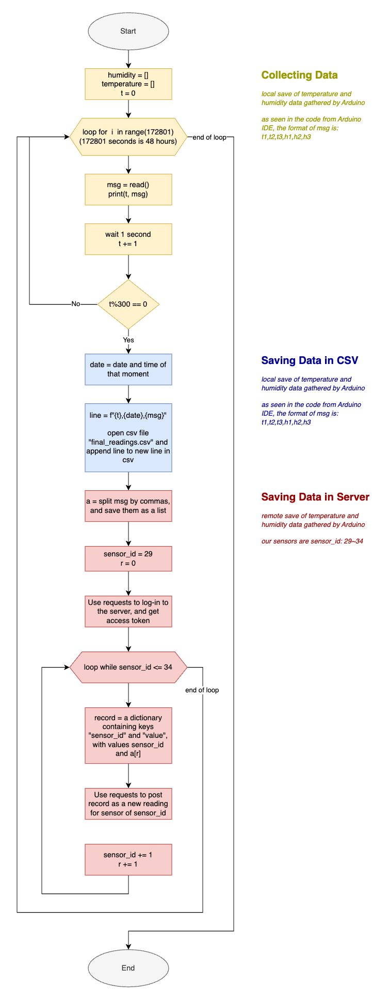

# Unit 2: A Distributed Weather Station for ISAK

## Criteria A: Planning

## Problem definition
As winter arrives, the residents of Room 20C of the house R4-Up have reported waking up to sore throats and cold-like symptoms in the mornings. They suspect that the main reason for this is either the temperature or humidity of the room, but they still believe that there is a possibility for other factors to be at play as well. If they can be sure the reason for their suffering is the temperature, the residents can collectively decide to turn up the heater in their room. Similarly, if they can be sure that the humidity is to blame, together they will invest in a humidifier (or dehumidifier) for their room.

Room 20C is asking for a way to record the temperature and humidity of the room, to be able to look back and review if they can conclude that one or both are contributing to their sufferings in the morning.

## Proposed Solution
Considering the client requirements an adequate solution includes a low cost sensing device for humidity and temperature and a custom data script that process and analyzes the samples acquired. For a low cost sensing device an adequate alternative is the DHT11 sensor[^1] which is offered online for less than 5 USD and provides adequare precision and range for the client requirements (Temperature Range: 0°C to 50°C, Humidity Range: 20% to 90%). Similar devices such as the DHT22, AHT20 or the AM2301B [^2] have higher specifications, however the DHT11 uses a simple serial communication (SPI) rather than more eleborated protocols such as the I2C used by the alternatives. For the range, precision and accuracy required in this applicaiton the DHT11 provides the best compromise. Connecting the DHT11 sensor to a computer requires a device that provides a Serial Port communication. A cheap and often used alternative for prototyping is the Arduino UNO microcontroller [^3]. "Arduino is an open-source electronics platform based on easy-to-use hardware and software"[^4]. In additon to the low cost of the Arduino (< 6USD), this devide is programable and expandable[^1]. Other alternatives include diffeerent versions of the original Arduino but their size and price make them a less adequate solution.

Considering the budgetary constrains of the client and the hardware requirements, the software tool that I proposed for this solution is Python. Python's open-source nature and platform independence contribute to the long-term viability of the system. The use of Python simplifies potential future enhancements or modifications, allowing for seamless scalability without the need for extensive redevelopment [^5][^6]. In comparison to the alternative C or C++, which share similar features, Python is a High level programming language (HLL) with high abstraction [^7]. For example, memory management is automatic in Python whereas it is responsability of the C/C++ developer to allocate and free up memory [^7], this could result in faster applications but also memory problems. In addition a HLL language will allow me and future developers extend the solution or solve issues proptly.  

**Design statement**
Using an arduino and DHT 11 sensors, we will construct a system that can measure the temperature and humidity of 3 different locations inside room 20C, where our client wishes to check. To do this, we will use Python in the IDE Pycharm, as well as a variation of C++ in the Arduino IDE [^8]. We will also create visualizations of the data that was collected using the pyplot module from the matplotlib library in Python, on Pycharm.

[^1]: Industries, Adafruit. “DHT11 Basic Temperature-Humidity Sensor + Extras.” Adafruit Industries Blog RSS, https://www.adafruit.com/product/386. 
[^2]: Nelson, Carter. “Modern Replacements for DHT11 and dht22 Sensors.” Adafruit Learning System, https://learn.adafruit.com/modern-replacements-for-dht11-dht22-sensors/what-are-better-alternatives.   
[^3]:“How to Connect dht11 Sensor with Arduino Uno.” Arduino Project Hub, https://create.arduino.cc/projecthub/pibots555/how-to-connect-dht11-sensor-with-arduino-uno-f4d239.  
[^4]:Team, The Arduino. “What Is Arduino?: Arduino Documentation.” Arduino Documentation | Arduino Documentation, https://docs.arduino.cc/learn/starting-guide/whats-arduino.  
[^5]:Tino. “Tino/PyFirmata: Python Interface for the Firmata (Http://Firmata.org/) Protocol. It Is Compliant with Firmata 2.1. Any Help with Updating to 2.2 Is Welcome. the Capability Query Is Implemented, but the Pin State Query Feature Not Yet.” GitHub, https://github.com/tino/pyFirmata. 
[^6]:Python Geeks. “Advantages of Python: Disadvantages of Python.” Python Geeks, 26 June 2021, https://pythongeeks.org/advantages-disadvantages-of-python/. 
[^7]: Real Python. “Python vs C++: Selecting the Right Tool for the Job.” Real Python, Real Python, 19 June 2021, https://realpython.com/python-vs-cpp/#memory-management. 
[^8]: Emeritus. "What are the Key Pros and Cons of the Arduino Programming Language?" Emeritus, Emeritus, 25 January 2023, https://emeritus.org/blog/coding-arduino-programming-language.
[^9]: Arduino. "Digital Pins." Arduino, Arduino, 5 December 2023, https://www.arduino.cc/reference/en/language/functions/digital-io/digitalwrite/.
[^11]: Koronus. "print multiple variables amount in one line." Arduino Forum, Arduino, 6 May 2021, https://forum.arduino.cc/t/print-multiple-variables-amount-in-one-line/604071/9

## Success Criteria
1. The solution provides a visual representation of the Humidity and Temperature values inside a dormitory (Local) and outside the house (Remote) for a period of minimum 48 hours. 
1. ```[HL]``` The local variables will be measure using a set of 3 sensors around the dormitory.
2. The solution provides a mathematical modelling for the Humidity and Temperature levels for each Local and Remote locations. ```(SL: linear model)```, ```(HL: non-lineal model)```
3. The solution provides a comparative analysis for the Humidity and Temperature levels for each Local and Remote locations including mean, standad deviation, minimum, maximum, and median.
4. ```(SL)```The Local samples are stored in a csv file and ```(HL)``` posted to the remote server as a backup.
5. The solution provides a prediction for the subsequent 12 hours for both temperature and humidity.
6. The solution includes a poster summarizing the visual representations, model and analysis created. The poster includes a recommendation about healthy levels for Temperature and Humidity.

_TOK Connection: To what extent does ```the use of data science``` in climate research influence our understanding of environmental issues, and what knowledge questions arise regarding the ```reliability, interpretation, and ethical implications``` of data-driven approaches in addressing climate change_

1. How does our use of technology shape our understanding of the environment
2. What responsibilities do we have as technologists when it comes to handling personal data related to our living spaces?
3. What cultural and contextual factors might impact our interpretation of the results, especially when comparing our local readings with those from the campus? 

# Criteria B: Design

## System Diagram **HL**


**Fig.1** shows the system diagram for the proposed solution (**HL**). The indoor variables will be measured using an Arduino and three DHT11 sensors located inside a room. Three sensors are used to determine more precisely the physical values and include measurement uncertainty. The outdoor variables will be requested to the remote server using a GET request to the API of the server at ```192.168.6.153/readings```. The local values are stored in a CSV database locally and a backup copy will be store in the remote server using the **Weather API**. 

## Flow Diagrams

**Fig.2** shows the flow diagram for the function "read" to retrieve data gathered in the arduino on Pycharm.


**Fig.3** shows the flow diagram for how the program collects humidity and temperature data on Pycharm, and then how this data is stored in a csv file and remote server.


**Fig.4**

## Test Plan


## Record of Tasks
| Task No | Planned Action                                     | Planned Outcome                                                                                                        | Time estimate | Target completion date | Criterion |
|---------|----------------------------------------------------|------------------------------------------------------------------------------------------------------------------------|---------------|------------------------|-----------|
| 1       | Write the Problem context                          |                                                                                                                        | 10min         | Nov 22                 | A         |
| 2       |                                                    |                                                                                                                        |               |                        | A         |
| 3       | Code and Upload Program for Arduino on Arduino IDE | Create and upload program for data collection onto the arduino                                                         | 30min         | Nov 29                 |           |
| 4       | Construct Arduino Circuit for Data Collection      | Have sensors connected to the Arduino, ready to connect to the computer and start collecting data                      | 1hr           | Nov 29                 |           |
| 5       | Code Data Collection Method on PyCharm             | Create a program that retrieves data from the Arduino, stores it in a csv file, and uploads it onto server on PyCharm. | 1hr           | Nov 29                 |           |
| 6       | Test and Finalize Hardware and Software            | Fix any bugs or add additional functions as necessary before starting final data collection                            | 3hr           | Nov 30                 |           |
| 7       | Collect Temperature and Humidity Data for 48 Hours | Collect data per 5 minutes over the course of 48 hours from 3 different sensors                                        | 48hr          | Nov 30 ~ Dec 3         |           |
| 8       | Construct Graphs Using Pyplot                      | Have graphs for raw data and average using pyplot                                                                      | 1hr           | Dec 4                  |           |

# Criteria C: Development
## List of techniques used
- For Loop
- While Loop
- If/Else Statements
- Functions
- Lists and Dictionaries
- Libraries
  - Comma Separated Values (CSV) Files
  - Serial Communication 
  - Application Programming Interface (API)
  - Data Visualization

## List of libraries used ```NEED TO DO THIS```
PyCharm: CSV, Time, Datetime, Requests, Matplotlib, Numpy, Pyfirmata

Arduino IDE: Adafruit DHT Sensor Library

## Development
### Code from Arduino IDE
In order to be able to read data from the sensors, there is a need to compile and upload a program to the arduino. This is done using the Arduino IDE. The code we wrote as follows:
```.C++
#include "DHT.h"
#define DHTTYPE DHT11   // DHT 11 Sensor

#define DHTPIN1 13     // what pin of the arduino each sensor's data pin is connected to
DHT dht1(DHTPIN1, DHTTYPE);
```
In the first line, we include the DHT.h class from the Adafruit Unified Sensor Library. This library is necessary in our program as it allows the arduino to identify and communicate with the DHT sensors connected to it. In the second line, we define the type of sensor we are using. For our solution, we are using the DHT11 sensor.

The third and fourth line defines the pin of the arduino that the sensor is connected to, and creates the sensor's identity so that it can be used in later programs. This is done for all 3 sensors, changing the number of the pin in the arduino (defining DHTPIN2, DHTPIN3), and then the corresponding id of the sensor (dht2, dht3).

```.C++
void setup() {
 pinMode(12, OUTPUT);//PIN 12 used as a 5V port
 digitalWrite(12,HIGH);
 pinMode(3, OUTPUT);//PIN 3 used as a 5V port
 digitalWrite(3,HIGH);
 Serial.begin(9600);
 Serial.println(F("Hello! Arduino has started"));
 dht1.begin();
 dht2.begin();
 dht3.begin();
}
```
Next, in this section we define the setup of the arduino. For digital pins of the Arduino, there is a need to configure them if they are used [9]. To do this, we use pinMode which takes two parameters, the pin number, and the mode in which it should behave. First, we specify that we wish to set up pin 12 as an output port. In the second line, we use digitalWrite, which takes the pin number and either "LOW" or "HIGH" as parameters to set the pin's output voltage. As DHT sensors require a 5V voltage to function, we set pin 12 to HIGH. The same is done for pin 3. Next, we start the serial communication between the arduino and the computer, and print a message to check if the arduino is working. In the last three lines, we start each of the sensors.

```.C++
void loop() {
  delay(1000);
  // Readings for DHT1
  float h1 = dht1.readHumidity();
  float t1 = dht1.readTemperature();
```
A loop is started to read data from the sensors every second. As shown above, first, the program tells the arduino to wait 1000 ms (1 second) at the start of each iteration. The program tells the arduino to read the humidity from the sensor dht1 as defined previously, and stores the value in the variable h1. The same is done for the temperature. This code is repeated for all the sensors, changing the number of the sensor (dht1, dht2, dht3) and the variable names (h1, t1, h2, t2, h3, t3) for each sensor. This results in 6 variables created by the arduino in total, a temperature and humidity variable per sensor.

```.C++
  //Check for errors
  if (isnan(h1) || isnan(t1) || isnan(h2) || isnan(t2) || isnan(h3) || isnan(t3)) {
   Serial.println(F("Failed to read from DHT sensor!"));
  return;
  }
```
Within the loop, next, the program checks to make sure that all the sensors read a value. In this if statement, if any of the variables is not a number (isnan), the program prints a message on the serial device and returns to the start of the loop.

```.C++
  // Print and check the readings for DHT1
  Serial.print(t1);
  Serial.print(",");
}
```
After checking for potential errors, the program can then proceed to printing the values of the collected temperatures and humidities on the serial device. This is the data that we can use on Pycharm after it gets transferred to the serial device, therefore we decided to send the collected data in the form of "t1,t2,t3,h1,h2,h3" as using Python, we can split this string by comma and reach each variable using the respective index of the list. According to the Arduino Forum, the best practice for printing multiple variables in one line for C++ is to repeat the serial.print() function[10]. The above code shows how we use two lines of code to print one variable, and a comma. These two lines are repeated for every other variable (t2, t3, h1, h2, h3).

### Code from PyCharm
First, we identified the need to be able to communicate with our remote server to back up our data. We decided to have a remote storage of the data we collected so that should the local backup malfunction or become inaccessible, the same data can be retrieved again my obtaining backup data on the server. 

From file ```API.py```:
```.py
import requests

user = {"username": "MMproject", "password": "MMproject2"}  # User on server
ip = "192.168.6.153"  # IP address of server
```
To be able to retrieve and send data to a server, there is first a need to import the requests library. This is done in the first line. The API of the server we will be using to store our data requires users to register first before being able to do certain functions. Hence, we then define the user data that will be used to register an user to upload the gathered data to the server. The details should be in the form of a json dictionary, which is the format used to store and transmit data between a user and server. We also store the ip address of the server as a string in the variable ip. This makes it easier to call the ip address in future requests.

```.py
# Register User [ONLY RUN ONCE]
answer = requests.post(f'http://{ip}/register', json=user)  # Register user, save result in answer
print(answer.json())  # Print answer to check if it worked
```
Next, there is a need to register the user on the server. This is done in the first line, by sending a POST request to the server with the user data that we stored in the dictionary user previously. This is done only once, as the user will be registered on the server after the first run of the program. In the next line, the result of the request is then printed to check if it worked.

```.py
# Log-in to get Cookie
answer = requests.post(f'http://{ip}/login', json=user)  #Login to server, save result in answer
print(answer.json())  # Print answer to check if it worked
cookie = answer.json()["access_token"]  # Get access token from server, save in cookie
print(cookie)  # Print cookie to check if it worked


# Put the cookie in the header of the request
header = {'Authorization':f'Bearer {cookie}'}  # Create header for authorization for future requests
```
After a user is registered, there is a need to login in order to gain access to more functions using the server. This is done in the first line by sending a POST request to access the login endpoint of the server. In the second line, the result of the request is then printed to check if it worked. Within this answer, there is an access token that is sent from the server to the user. An access token allows the user to access further functions on the server that is limited to only users that are logged in. In the third line, this access token is stored in the variable cookie. In the fourth line, the cookie is printed to check if the access token was saved correctly.

We also save the cookie in the dictionary header, as the value of the key 'Authorization.' This is done as for functions that require a logged-in user, a header is required to be sent with the request. If there is a valid access token within the header, the request can be done. Like the ip address, saving the header in a dictionary makes it easier to call the header in future requests.

```.py 
# Create Sensors [ONLY RUN ONCE]
s1_t = {
    'type': 'temperature',
    'location': 'table',
    'name': 'dht1_temp',
    'unit': 'C'
} #id=29 (id of the sensor created at the first run of this program)

answer = requests.post(f'http://{ip}/sensor/new', json=s1_t, headers=header)  # Create new sensor on server, changing the json parameter for each sensor
```
Next, there is a need to create new sensors on the server, which is the remote storage of our collected temperature and humidity data. This can be done by sending a POST request. In the first line, we create a dictionary for the data required in the sensor. In our server, this includes the type of sensor, the location of the sensor, the name of the sensor, and the unit of the measurements used. Each of these are keys in the dictionary, and the values are changed as we create new sensors. In the second line, we send the POST request to the server to create a new sensor. The json parameter is the dictionary we created previously, and the header is the header we created previously. This is repeated for all the sensors, changing the values of the keys in the dictionary sent. This resulted in 6 sensors on the server, each with a unique id from 29~34.


Next, there is a need to collect data from the arduino in a form that can be manipulated in the serial device (computer connected to the arduino) for storage. First, we identified the need to create a function on PyCharm that reads the data sent by the arduino.

From file ```solution.py```
```.py
import serial
id = "cu.usbserial-110"  #id of Arduino on computer
arduino = serial.Serial(port=f'/dev/{id}', baudrate=9600, timeout=0.1)  #id of Arduino on computer
print("Connection Successful")  #Let user know Arduino is connected
```
In order to be able to take the data collected on the arduino, here is a need to create a serial connection between the arduino and the computer. This can be done by importing the serial library. In the first line, we store the id of the arduino as identified by the computer in the variable id. In the second line, we use the serial.Serial() function. The port parameter is the id of the arduino. This connection is stored as the variable arduino, which can be used again later. In the last line, we print a message to the user to check that the connection has been established.

Next, we created a function that reads the data collected on the arduino. This is shown in fig. 2,  as well as in the program that follows:
```.py
def read() -> str:
    """Read data from Arduino. Return data as a string."""
    data = ""  # Create empty string
    while len(data) < 1:  # When data is empty
        data = arduino.readline()  # Read data collected on Arduino (sensors)
    return data.decode('utf-8')  # utf-8 is the same as ascii
```
In the first line we create an empty string and store it as the variable data. In the next line, using a while loop, we check if the length of the string is less than 1 (if the string is empty.) This is to ensure that the program does not store empty data or read the next collected data before it stores the previous one. If the string is empty, the program proceeds to read the data collected on the arduino using the readline() function. The line read refers to the string containing the 6 measurements that was created in the Arduino IDE. In the last line, the data is returned from the function as a string, and decoded into ascii.

```.py
humidity = []  # List to store humidity data
temperature = []  # List to store temperature data
t = 0  # Variable to store time elapsed in seconds
for i in range(172801):  # Loop for 17800 seconds (=48 hours)
    msg = read()  # Read data from Arduino
    print(t, msg)  # To check what data the program reads
    time.sleep(1)  # Wait 1 second
    t += 1  # Add 1 to the variable t corresponding to the seconds passed
```

```.py
    # Record the data once in 5 minutes
    if t%300 == 0:  # Per 5 minute interval (=300 seconds)
        # Storing Data in CSV File
        date = datetime.datetime.now()  # Find time data of the moment
        line = f'{t},{date},{msg}\n'  # Time in seconds, datetime, msg containing sensor readings
        with open('final_readings.csv', mode='a') as f:  # Open file in mode append
            data = f.writelines(line)  # Add line to CSV file
```

```.py
import requests
from API import ip, header
```
To do this, the requests library has been imported for this file. We also import ip and header which had been previously defined in the file ```API.py``` to be able to access the POST sensor data endpoint of the server. We post the data collected within the same if statement as previously defined:

```.py
        # Storing Data in Sensors on Server
        a = list(msg.split(',')) # Split the msg (data from Arduino) into a list
        sensor_id = 29  # First of our sensors on the server
        r = 0  # Index of the list of readings

        # Create new posts for each sensor on the server
        while sensor_id <= 34:  # Loop through all of our sensors
            record = {f'sensor_id':sensor_id, 'value':a[r]}  # Create a record for each sensor
            print(record)  # To check what data the program sends to the server
            answer = requests.post(f'http://{ip}/reading/new', json=record, headers=header)  # Send data to server
            sensor_id += 1  # Next sensor
            r += 1  # Next reading
```
# Criteria D: Functionality

A 7 min video demonstrating the proposed solution with narration
